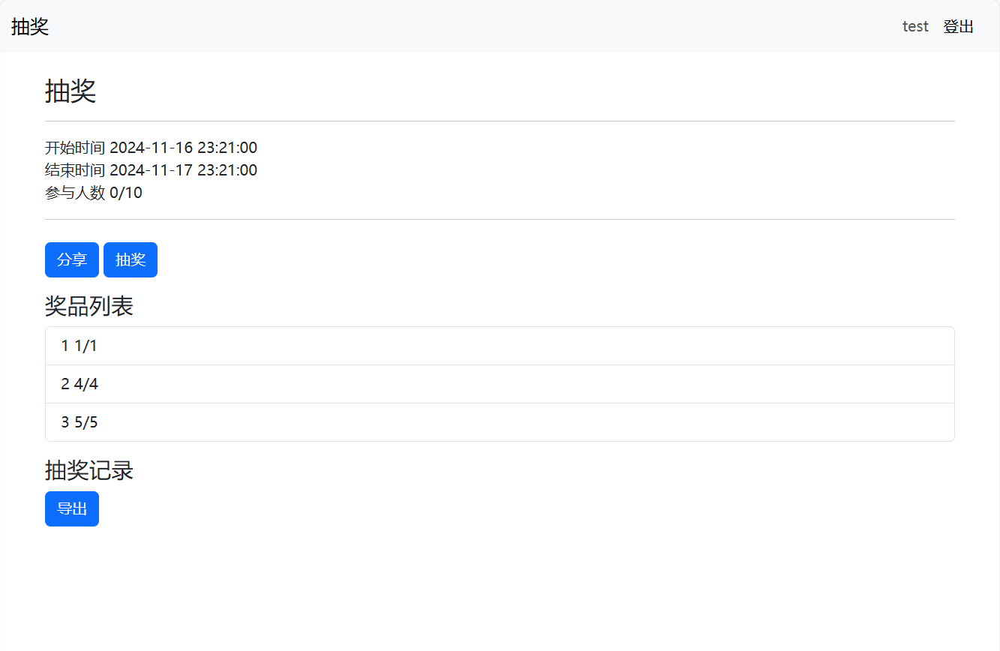

在线抽奖系统
===

工具和方法
===
前端：
- HTML
- [Bootstrap](https://v5.bootcss.com/docs/getting-started/introduction/)

后端：  
- `Python+Flask`
- 本地`json`文件

特点
===
- 抽奖结果导出：导出为 `csv` 文件
- 系统分享与邀请：支持展示⼆维码。

部署
===
Python3

虚拟环境
---
推荐
```
python3 -m venv venv
. venv/bin/activate
```
安装
---
```
pip install -r requirements.txt
```

运行
---
本地
```
waitress-serve --host 127.0.0.1 --call lottery_system:create_app
```
公开
```
waitress-serve --host 0.0.0.0 --call lottery_system:create_app
```

基本功能
===
所有抽奖


---
注册登录


---
创建抽奖


---
抽奖详情


---
高亮结果


---
分享活动


---
导出结果


---
